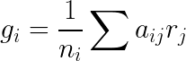
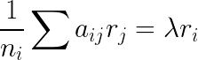
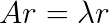

# How I Picked My 2018 Bracket

Normally, I don't like to participate in NCAA bracket competitions;
odds at best a coin flip and gain is very little, almost as little as
my interest in collegiate basketball. This year, I decided to try and
use mathematical modeling to come up with an optimal bracket according
to some constraints or rules. The goal was to create a simple ruleset,
creating a bracket without in depth consideration with specific point
values, rosters, etc.

## Formula

Say that we can associate with each team i a "goodness" measure
gi. We would like for the goodness to depend upon
performance during games, but not on the number of games played, in
case one team has played more games than others; its rank should not
be boosted just by playing more games. Thus we need a normalizing
factor 1/ni. We want to take a summation of strength
displayed over each game played. In other words, we can say that
gi is a sum with respect to strengths of other teams - and
we'll throw in a coefficient aij for good measure. Then to
bring it together, we have

This is nice so far. When we are talking about strength and
"goodness", being strong and being good should be the same - or at
least proportional. So we can say

and this is *really* good because we have a set of linear
equations. Namely, considering all the aij as entries in a
matrix, we obtain

Aha! So lambda is an eigenvalue, and the vector of "strengths" or
"ratings" is the corresponding eigenvector. If we restrict entries of
A to be nonnegative, there will be a maximum eigenvalue and its
eigenvector will be the rankings we seek.

Finally, we need to discuss what each entry of the matrix means. We
need to construct an idea of preference with respect to two teams i
and j, and I think the simplest way to do it is to just say that each
entry aij denotes the number of times team i has won
against team j. Thus, the entries of A are nonnegative, as we want
them.

## Data mining

Fortunately, I was able to find a seemingly trustworthy data source at
[spreadsheetsports.com](https://spreadsheetsports.com), where I
located an included spreadsheet containing game outcomes from the past
season.  Using the fantastic [pyexcel
library](https://github.com/pyexcel/pyexcel) I unpacked the data into
a dictionary. I was then able to construct a list of teams, and
importantly establish a one-to-one correspondence between the 656
teams and the set {0, 1, ..., 655} so that we can talk about numbers
and teams equivalently (this lets us address the matrix in terms of
numbers later). Then, we initialize the matrix (a numpy array) and
begin filling it with the data. A tabulation of the number of games
played by each team is also kept for normalization. An easy check to
make sure the matrix is correct is to sum the elements (should be the
total number of games played during the season) and compute the trace
(should be zero; teams can't win against themselves).

## Computation and filling the bracket

Next, numpy's linalg component is used to obtain the eigenvalues and
eigenvectors. The maximal eigenvalue and its corresponding eigenvector
are saved, then we use our earlier one-to-one correspondence to get
team names back from the index values of the vector. Finally, we
construct a dictionary with each team and its "rating" in the
eigenvector. The result is shown in `results.txt`.

To fill the bracket itself, there is a nontrivial consideration. Only
a fraction of the teams that played during the season will participate
in the tournament. This can be easily accounted for. We have the
ratings sorted in descending order, so we need only look at teams in
the list when they belong to the bracket. My goal is to fill out the
bracket with as little human interference as possible, so I'm going to
keep the algorithm simple. The highest rated team will be placed in
the tournament winning slot. Branching out, the next highest rated
teams will be placed in semifinals, quarterfinals, etc. If any sort of
impossibility should occur in placing a team in a slot, the next most
appropriate team based on rating will be placed there instead. I guess
I'm having trouble explaining it, but hopefully you get the idea.

I'm going to enter this bracket into a for-fun pool with some friends,
just so we can see how it performs. My interest is strictly
mathematical. I'm interested in seeing just how well this strategy
works, and if it is worthy of being applied to other similar scenarios
from a data-scientific perspective.
